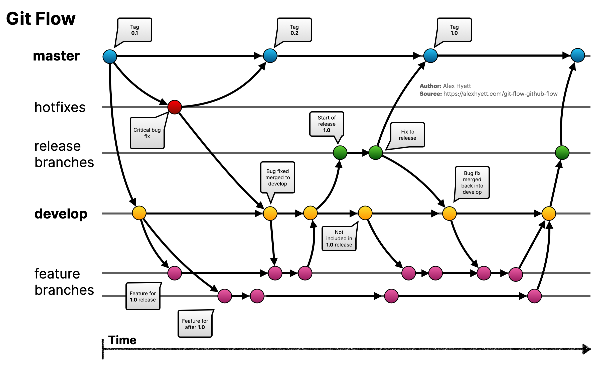
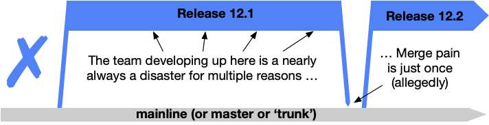

<SlideCurrentNo absolute bottom-0 right-2/>
<Link to="workflows" absolute top-3.4 font-bold right-15 color="#db4c37">Workflows</Link>

# Summary

1. <Link to="introduction">Introduction</Link>
2. <Link to="installation-and-configuration">Installation and configuration</Link>
3. <Link to="fundamental-principles">Fundamental principles</Link>
4. <Link to="commits-and-history">Commits and history</Link>
5. <Link to="references">References</Link>
6. <Link to="merge-rebase">Merge - Rebase</Link>
7. <Link to="other-commands-and-tools">Other commands and tools</Link>
8. <Link to="my-history-is-beautiful">My History is Beautiful</Link>
9. <Link to="remotes">Remotes</Link>
10. **Workflows**

---

<SlideCurrentNo absolute bottom-0 right-2/>
<Link to="workflows" absolute top-3.4 font-bold right-15 color="#db4c37">Workflows</Link>

# Workflows

<v-click>

## Why?

- Git is a CLI, with a lot of possibilities
- It's a set of tools to handle commits, branches, etc
- But, how to harmonize and organize all this work?
</v-click>

<v-click>

## What's a workflow concretely?

- Simply a set of rules defining usages about tags, branches, commits, etc
    - Rules about commit structures
    - Rules about branch naming
    - Rules about branch strategy
    - etc

</v-click>

---
layout: quote
---

<SlideCurrentNo absolute bottom-0 right-2/>
<Link to="workflows" absolute top-3.4 font-bold right-15 color="#db4c37">Workflows</Link>

## Which workflows have you encountered?

## What's your opinion about them?

---

<SlideCurrentNo absolute bottom-0 right-2/>
<Link to="workflows" absolute top-3.4 font-bold right-15 color="#db4c37">Workflows</Link>

# Workflows

<v-clicks>

- How to choose the good workflow?
- Workflows has to facilitate team work; dev, bug, delivery, etc
- Adapted to the team and company context
  - Team size
  - Asset type
  - Infrastructure
  - Business needs
- It's only a workflow :)
</v-clicks>

---

<SlideCurrentNo absolute bottom-0 right-2/>
<Link to="workflows" absolute top-3.4 font-bold right-15 color="#db4c37">Workflows</Link>

# Workflows - GitFlow
[Gitflow Workflow](https://www.atlassian.com/git/tutorials/comparing-workflows/gitflow-workflow)

<v-clicks>

- Multiple long-lived branches
  - master (or main)
  - develop
- A lot of merges between branches
- Delayed merges
- Each branch type has a role
</v-clicks>

---

<SlideCurrentNo absolute bottom-0 right-2/>
<Link to="workflows" absolute top-3.4 font-bold right-15 color="#db4c37">Workflows</Link>

# Workflows - Trunk-Based Development
[trunkbaseddevelopment.com](https://trunkbaseddevelopment.com/)

One branch ("**trunk**") as the single source of truth

<v-clicks>

- Changes from *GitFlow*
  - No more `develop` branch
  - releases do not not branches anymore
  - no more "hotfix", a change is provided to the trunk
- To note:
  - More suitable for short development lifecycles (several deployment/day)
  - Needs a rigorous automated CI/CD testing (before and after deployment)
</v-clicks>
  
---

<SlideCurrentNo absolute bottom-0 right-2/>
<Link to="workflows" absolute top-3.4 font-bold right-15 color="#db4c37">Workflows</Link>

# Workflows - Trunk-Based Development
[trunkbaseddevelopment.com](https://trunkbaseddevelopment.com/)

- This approach creates:
  - Huge deviation between the mainline and the active branch
  - Rises the risk for a big-bang merge with a lot of pain

---

<SlideCurrentNo absolute bottom-0 right-2/>
<Link to="workflows" absolute top-3.4 font-bold right-15 color="#db4c37">Workflows</Link>

# Workflows - Trunk-Based Development
[trunkbaseddevelopment.com](https://trunkbaseddevelopment.com/)

Trunk-Based Development for smaller teams

---

<SlideCurrentNo absolute bottom-0 right-2/>
<Link to="workflows" absolute top-3.4 font-bold right-15 color="#db4c37">Workflows</Link>

# Workflows - Trunk-Based Development
[trunkbaseddevelopment.com](https://trunkbaseddevelopment.com/)

**Scaled** Trunk-Based Development

---

<SlideCurrentNo absolute bottom-0 right-2/>
<Link to="workflows" absolute top-3.4 font-bold right-15 color="#db4c37">Workflows</Link>

# Workflows - Last Words

- There is no "perfect" workflow ([No Silver Bullet](https://worrydream.com/refs/Brooks_1986_-_No_Silver_Bullet.pdf))
- Must be adapted to context (business, technical, etc)

---
layout: end
---

<SlideCurrentNo absolute bottom-0 right-2/>

# Thanks
