<SlideCurrentNo absolute bottom-0 right-2/>
<Link to="references" absolute top-3.4 font-bold right-15 color="#db4c37">References</Link>

# Summary

1. <Link to="introduction">Introduction</Link>
2. <Link to="installation-and-configuration">Installation and configuration</Link>
3. <Link to="fundamental-principles">Fundamental principles</Link>
4. <Link to="commits-and-history">Commits and history</Link>
5. <span v-mark.box.green="{ at: 1, animate: false }">**references**</span>
6. <Link to="merge-rebase">Merge - Rebase</Link>
7. <Link to="other-commands-and-tools">Other commands and tools</Link>
8. <Link to="my-history-is-beautiful">My History is Beautiful</Link>
9. <Link to="remotes">Remotes</Link>
10. <Link to="workflows">Workflows</Link>
---


<SlideCurrentNo absolute bottom-0 right-2/>
<Link to="references" absolute top-3.4 font-bold right-15 color="#db4c37">References</Link>

# References
2 kinds

<v-clicks>

- <span v-mark.green.highlight="{at: 1, animate: false}">Mutable ones</span>
  - **Branches**: `main`, `feature/42-add`, `origin/add`, etc
  - **Symbolic**: `HEAD`, `FETCH_HEAD`, `ORIG_HEAD`, etc
- <span v-mark.green.highlight="{at: 2, animate: false}">Immutable ones</span>
  - **Tags**: `0.0.1`, `2.3.9`, `latest`, etc
  - _We can still force an immutable tag to point to another commit, but it is not straight-forward._
</v-clicks>

---
clicks: 2
---


<SlideCurrentNo absolute bottom-0 right-2/>
<Link to="references" absolute top-3.4 font-bold right-15 color="#db4c37">References</Link>

# Create a branch
`git branch <branch_name>`

To create a branch from `HEAD` while staying in the current branch:
```bash {0|1|2}
git branch feature
git commit
```

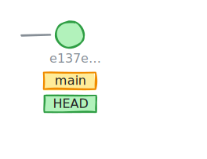
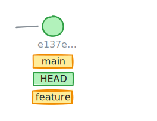
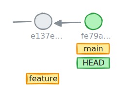

---
clicks: 2
---


<SlideCurrentNo absolute bottom-0 right-2/>
<Link to="references" absolute top-3.4 font-bold right-15 color="#db4c37">References</Link>

# Create a branch
`git switch`

To create a branch from `HEAD` and switch to the new branch:
```bash {0|1|2}
git switch --create feature # or git switch -c feature
git commit
```

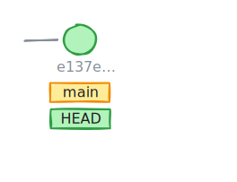
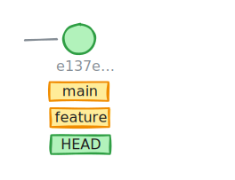
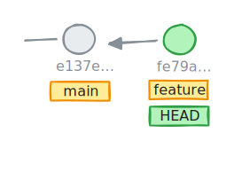

---


<SlideCurrentNo absolute bottom-0 right-2/>
<Link to="references" absolute top-3.4 font-bold right-15 color="#db4c37">References</Link>

# List branches
`git branch`


````md magic-move
```bash
# To list local branches
git branch
```

```bash
# To list local branches
git branch
* feature
main
```
````

<div v-click="2" mt-5>

```bash {0|1-3|5-7}
# Find branches in the repository
ls .git/refs/heads
feature main

# Check what's inside a branch
cat .git/refs/heads/feature
da311acf046236625b19e0c1c149b99ddde9dc39
```
</div>

---
clicks: 4
---


<SlideCurrentNo absolute bottom-0 right-2/>
<Link to="references" absolute top-3.4 font-bold right-15 color="#db4c37">References</Link>

# Delete a branch
`git branch --delete`

```bash {0|1|3-4|6}
git branch --delete feature # or git branch -d feature

git branch --delete fix1
error: The branch 'fix1' is not fully merged

git branch --delete --force fix1 # or git branch -D fix1
```

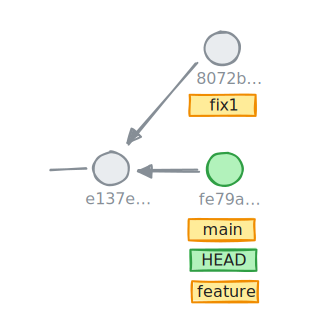
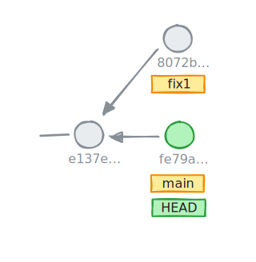
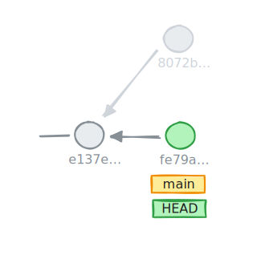

<div v-click w-100 ml-100 mt-17 border border-blue border-4 pl-3 pr-3>

<div mt-3 text-center> ⚠️ Only the reference is deleted ⚠️  </div>

The **commit** is <span v-mark.green.highlight="{at: 4, animate: false}">preserved</span> until the next **garbage collecting** occurs. The commit is still reachable through the **reflog**.
</div>

---
clicks: 5
---


<SlideCurrentNo absolute bottom-0 right-2/>
<Link to="references" absolute top-3.4 font-bold right-15 color="#db4c37">References</Link>

# Move between references
`git switch`

The `switch` commands:
- replaces the `working tree` and the `index` content by the content pointed by the targeted reference
- moves automatically `HEAD` to the targeted reference (a `branch`, a `tag`, a `commit`, etc)
- Fails if there is modifications in the working tree

<div w-100 mt-3 >

```bash {0|1-2|4-5|7|8|*}
# Switches to branch "feature"
git switch feature

# Switches in detach mode to a commit
git switch --detach 9ff24 # or git switch -d 9ff24

git commit
git switch -c hotfix
```
</div>

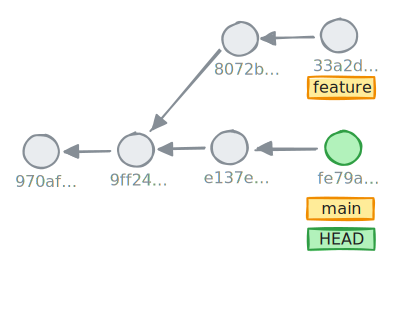
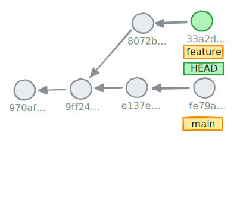
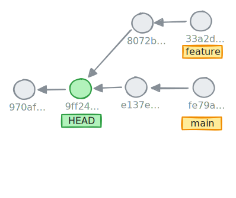
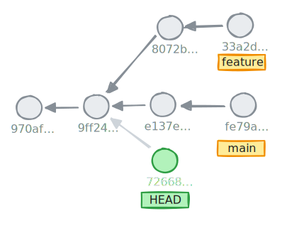
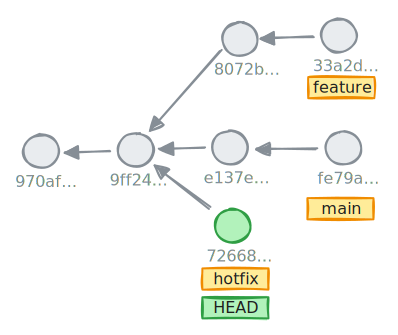

---


<SlideCurrentNo absolute bottom-0 right-2/>
<Link to="references" absolute top-3.4 font-bold right-15 color="#db4c37">References</Link>

# Reflog
A useful fault recovery tool

Reflog stands for "Reference logs", it's a log keeping all **references modifications**, even those that are no more accessible.

````md magic-move
```bash
# List all references changes for current branch
git reflog [show] [<ref>]
```
```bash
# List all references changes for current branch
git reflog [show] [<ref>]

cdac25a (HEAD -> main, origin/main) HEAD@{0}: commit (amend): feat: add slides
da311ac (fix1) HEAD@{1}: checkout: moving from fix1 to main
fee4947 HEAD@{2}: commit: fix: remove build misconfiguration
```
````
<v-clicks>

```bash
git switch --detach HEAD@{2} # Switches to fee4947 commit
```

<div text-center mt-5 border border-blue border-4>

By default, _unreachable_ commits have a lifespan of **30 days**.
</div>
</v-clicks>

---
clicks: 2
---


<SlideCurrentNo absolute bottom-0 right-2/>
<Link to="references" absolute top-3.4 font-bold right-15 color="#db4c37">References</Link>

# Reset
Handling the tip of a branch

`reset` is a command that:
- moves the tip of a branch on a specific location
- potentially resets the `working tree` or the `index`

Main usages:
- reset a branch to one of its previous commits
- move the branch to an arbitrary location

<div v-click="1" w-115 mt-9>

```bash {0|0|1}
git reset 33a2d # or git reset @^^ or git reset HEAD~2
```
</div>

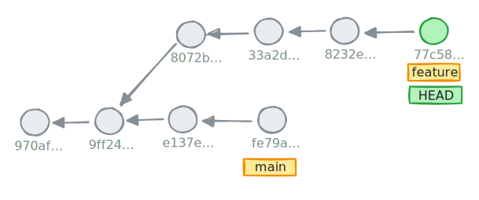
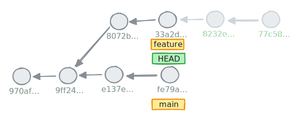

---


<SlideCurrentNo absolute bottom-0 right-2/>
<Link to="references" absolute top-3.4 font-bold right-15 color="#db4c37">References</Link>

# Reset, all modes
How to handle `working tree` and `index`

- `--soft`
  - does not modify the `working tree` nor the `index`
- `--mixed`
  - ***default***, resets `index` but keeps the `working tree` as is
- `--hard`
  - resets the `working tree` **and** the `index`

<div v-click="1" w-110 scale-70 mt="-5" ml="-10">

| | **working tree** | **index** |
| :---: | :---: | :---: |
|before reset | 77c58 | 77c58 |
|`reset --soft` | 33a2d + diff | 33a2d + diff |
|`reset --mixed` | 33a2d + diff | 33a2d |
|`reset --hard` | 33a2d | 33a2d |
</div>


---
clicks: 6
---


<SlideCurrentNo absolute bottom-0 right-2/>
<Link to="references" absolute top-3.4 font-bold right-15 color="#db4c37">References</Link>

# Tags
To label commits

```bash {*|1-2|4-5|7-8|10-14|16-17|19-20|*}
# Tags HEAD
git tag 2.0.0

# Annotated tag
git tag --annotate latest --message "latest at 2.0.0"

# Tag the commit 9ff24
git tag 1.0.0 9ff24

# Lists all tags
git tag --list
1.0.0
2.0.0
latest

ls .git/refs/tags
1.0.0 2.0.0 latest

cat .git/refs/tags/1.0.0
9ff2486e8a04e3437ef93d2869c00c3300a11349
```

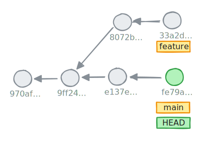
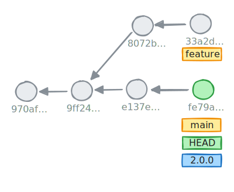
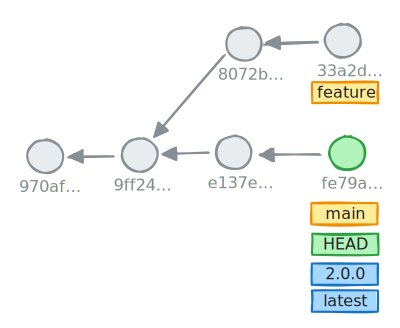
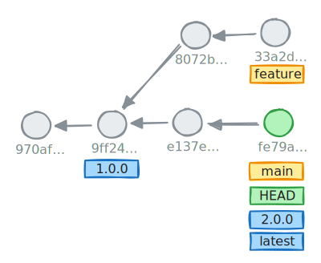

---

<div border-7 border-blue absolute top-0 left-0 bottom-0 right-0 z="-1"/>

<SlideCurrentNo absolute bottom-0 right-2/>
<Link to="references" absolute top-3.4 font-bold right-15 color="#db4c37">References</Link>

# Hands-on - 15 minutes

```bash
git clone https://github.com/Tenshock/git-exercise.git reference
cd reference
git switch sandbox # ⚠️
```

1. Add a file `LICENSE` and commit it
2. Do modifications in `sandbox.txt` and commit it
3. Go back enough to cancel the `LICENSE` file add but still commit the modifications made to `sandbox.txt`
4. Create a branch `test` from commit 52cd07e and switch on it
5. Add a file `test.txt` and commit it
6. List local branches
7. Tag the current commit and name it `backup`
8. Tag the most ancient commit and name it `0.0.1`
9. Go back to `main` branch, list all tags
10. Delete the branches `sandbox` and `test`
12. Sorry, we wanted the `sandbox` and `test` branches finally. Recreate them.

---

<div border-7 border-green absolute top-0 left-0 bottom-0 right-0 z="-1"/>

<SlideCurrentNo absolute bottom-0 right-2/>
<Link to="references" absolute top-3.4 font-bold right-15 color="#db4c37">References</Link>

# Correction

1. Add a file `LICENSE` and commit it
```bash
echo "Free to reuse" > LICENSE
git add LICENSE
git commit -m "chore: add LICENSE file"
```

2. Do modifications in `sandbox.txt` and commit it

```bash
echo "some content" >> sandbox.txt
git commit -am "chore: update sandbox file"
```

3. Go back enough to cancel the `LICENSE` file add but still commit the modifications made to `sandbox.txt`
```bash
git reset --mixed HEAD~2
rm LICENSE
git commit -am "chore: update sandbox file"
```

4. Create a branch `test` from commit 52cd07e and switch on it
```bash
git switch -c test 52cd07e
# or
git branch test 52cd07e
git switch -c test
```

---

<div border-7 border-green absolute top-0 left-0 bottom-0 right-0 z="-1"/>

<SlideCurrentNo absolute bottom-0 right-2/>
<Link to="references" absolute top-3.4 font-bold right-15 color="#db4c37">References</Link>

# Correction

5. Add a file `test.txt` and commit it
```bash
echo "My file" > test.txt
git add test.txt
git commit -m "chore: add test.txt file"
```

6. List local branches
```bash
git branch
```

7. Tag the current commit and name it `backup`
```bash
git tag backup
```

8. Tag the most ancient commit and name it `0.0.1`
```bash
git tag 0.0.1 95aadcc
```

9. Go back to `main` branch, list all tags
```bash
git switch main
git tag --list
```
---

<div border-7 border-green absolute top-0 left-0 bottom-0 right-0 z="-1"/>

<SlideCurrentNo absolute bottom-0 right-2/>
<Link to="references" absolute top-3.4 font-bold right-15 color="#db4c37">References</Link>

# Correction

10. Delete the branches `sandbox` and `test`
```bash
git branch -D sandbox test
```

11. Sorry, we wanted the `sandbox` and `test` branches finally. Recreate them.
```bash
git branch test backup

git reflog
git branch sandbox <commit_id>
```

