<SlideCurrentNo absolute bottom-0 right-2/>
<Link to="merge-rebase" absolute top-3.4 font-bold right-15 color="#db4c37">Merge - Rebase</Link>

# Summary

1. <Link to="introduction">Introduction</Link>
2. <Link to="installation-and-configuration">Installation and configuration</Link>
3. <Link to="fundamental-principles">Fundamental principles</Link>
4. <Link to="commits-and-history">Commits and history</Link>
5. <Link to="references">References</Link>
6. <span v-mark.box.green="{ at: 1, animate: false }">**merge - rebase**</span>
7. <Link to="other-commands-and-tools">Other commands and tools</Link>
8. <Link to="my-history-is-beautiful">My History is Beautiful</Link>
9. <Link to="remotes">Remotes</Link>
10. <Link to="workflows">Workflows</Link>
---


<SlideCurrentNo absolute bottom-0 right-2/>
<Link to="merge-rebase" absolute top-3.4 font-bold right-15 color="#db4c37">Merge - Rebase</Link>

# Merge branches together
`git merge`

- Merge **two** branches (or more)
- Permits to retrieve branches changes to another branch
- A merge is done **from** the destination branch
- 2 cases: `fast forward` and `no fast forward`

---
clicks: 1
---


<SlideCurrentNo absolute bottom-0 right-2/>
<Link to="merge-rebase" absolute top-3.4 font-bold right-15 color="#db4c37">Merge - Rebase</Link>

# Merge - Fast Forward
The simplest case

When the **destination branch** is a direct ancestor of the branch to be merged.

```bash {0|1}
git merge feature # or git merge --ff feature
```

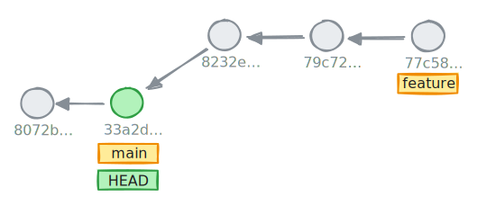
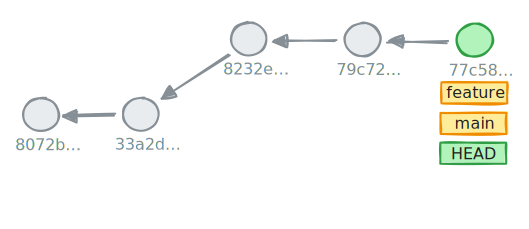

---
clicks: 1
---


<SlideCurrentNo absolute bottom-0 right-2/>
<Link to="merge-rebase" absolute top-3.4 font-bold right-15 color="#db4c37">Merge - Rebase</Link>

# Merge - No Fast Forward
With a merge commit!

When branches have diverged.

```bash {0|1}
git merge feature # or git merge --no-ff feature
```

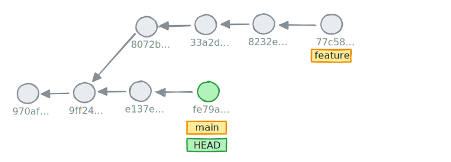
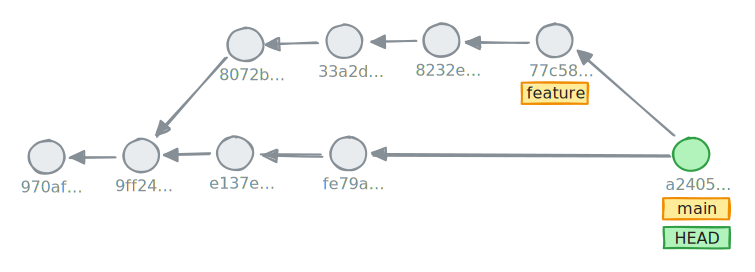

---


<SlideCurrentNo absolute bottom-0 right-2/>
<Link to="merge-rebase" absolute top-3.4 font-bold right-15 color="#db4c37">Merge - Rebase</Link>

# Merge - Fast Forward Only!
When we want a straight history

If we want to enforce a linear history, we can use `-ff-only` flag.

````md magic-move
```bash {0}
git merge --ff-only feature
```

```bash
git merge --ff-only feature
fatal: Not possible to fast-forward, aborting.
```
````


---
clicks: 1
---


<SlideCurrentNo absolute bottom-0 right-2/>
<Link to="merge-rebase" absolute top-3.4 font-bold right-15 color="#db4c37">Merge - Rebase</Link>

# Merge - No Fast Forward in a Fast Forward case?
When we want a semi-linear history

If we want to enforce merge commits, we can use `-no-ff` flag.

```bash {0|1}
git merge --no-ff feature
```

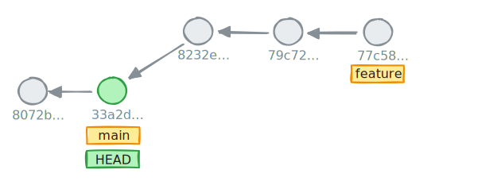
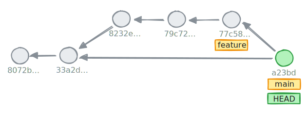

---


<SlideCurrentNo absolute bottom-0 right-2/>
<Link to="merge-rebase" absolute top-3.4 font-bold right-15 color="#db4c37">Merge - Rebase</Link>

# Merge - Conflict
What's under the hood?

- 2 branches update the same section in the same file
- The conflict cannot be resolved automatically
- Git suspend the merge and let the user handle the conflict
- Resolution
  - manual
  - git mergetool
  - from IDE or other graphical tools

---
clicks: 9
---


<SlideCurrentNo absolute bottom-0 right-2/>
<Link to="merge-rebase" absolute top-3.4 font-bold right-15 color="#db4c37">Merge - Rebase</Link>

# Merge - Conflict

<div absolute w-217 v-click="[0,3]" >

````md magic-move { at: 2 }
``` {0}
git merge feature
```
```bash
git merge feature
Auto-merging file.txt
CONFLICT (content): Merge conflict in file.txt
Automatic merge failed; fix conflicts and then commit the result.
```
````
</div>

<div absolute w-217 v-click="[3,5]">

````md magic-move { at: 4 }
```bash
git status
```
```bash
git status
On branch main
You have unmerged paths.
  (fix conflicts and run "git commit")
  (use "git merge --abort" to abort the merge)

Unmerged paths:
  (use "git add <file>..." to mark resolution)
        both modified:   file.txt

no changes added to commit (use "git add" and/or "git commit -a")
```
````
</div>

<div absolute w-217 v-click="[5]">

```
nvim file.txt
file content

< <<<<<< HEAD
Text being on the main branch in this case.
=======
Text being on the feature branch.
>>>>>>> feature
```
</div>

<div absolute w-217 v-click="[6,10]">

````md magic-move { at: 7 }
```bash {1}
git add file.txt
git merge --continue
```
```bash {2,3}
git add file.txt
git merge --continue
[main a2405a6] Merge branch 'feature'
```
```bash {5}
git add file.txt
git merge --continue
[main a2405a6] Merge branch 'feature'

git merge --abort # during merge
```
```bash {6}
git add file.txt
git merge --continue
[main a2405a6] Merge branch 'feature'

git merge --abort # during merge
git reset --hard HEAD^ # after merge
```
````
</div>


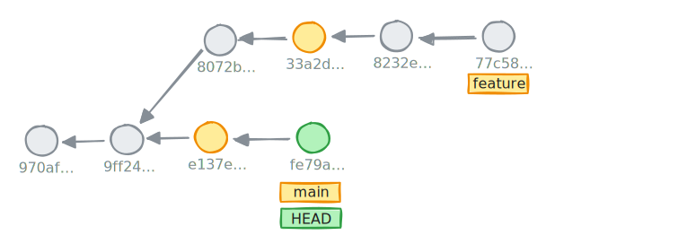

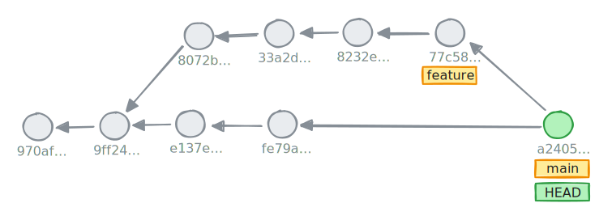
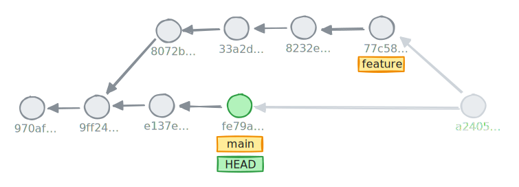

---

<div border-7 border-blue absolute top-0 left-0 bottom-0 right-0 z="-1"/>

<SlideCurrentNo absolute bottom-0 right-2/>
<Link to="merge-rebase" absolute top-3.4 font-bold right-15 color="#db4c37">Merge - Rebase</Link>

# Hands-on - 15 minutes

```bash
git clone https://github.com/Tenshock/git-exercise.git merge-rebase
cd merge-rebase
[bash|zsh] init-1.sh
```

1. Merge `hotfix` branch into `master` branch without choosing a mode. Which mode is used?
2. Merge `feature` branch into `main` while accepting automatically the commit message and without choosing a mode. Which mode is used?
3. Cancel the `hotfix`-`master` merge
4. Merge `hotfix` branch into `master` with a merge commit with a predefined merge commit message
5. Merge `hotfix` branch into `feature` without a merge commit. What's happening?
6. Merge `conflict` branch into `main`. Handle the conflict by accepting both modifications, put the `HEAD` modification below the other one
7. **BONUS**: Configure the project so that the merge is always a _no fast-forward_ one

---

<div border-7 border-green absolute top-0 left-0 bottom-0 right-0 z="-1"/>

<SlideCurrentNo absolute bottom-0 right-2/>
<Link to="merge-rebase" absolute top-3.4 font-bold right-15 color="#db4c37">Merge - Rebase</Link>

# Correction


1. Merge `hotfix` branch into `master` branch without choosing a mode. Which mode is used?
```bash
git switch master
git merge hotfix # It's a fast forward merge
```

2. Merge `feature` branch into `main` while accepting automatically the commit message and without choosing a mode. Which mode is used?
```bash
git switch main
git merge --no-edit feature # It's a no fast forward merge
```

3. Cancel the `hotfix`-`master` merge
```bash
git switch master
git reset --hard HEAD^^
```

4. Merge `hotfix` branch into `master` with a merge commit with a predefined merge commit message
```bash
git merge hotfix --no-ff -m 'merge: merge hotfix into master'
```

---

<div border-7 border-green absolute top-0 left-0 bottom-0 right-0 z="-1"/>

<SlideCurrentNo absolute bottom-0 right-2/>
<Link to="merge-rebase" absolute top-3.4 font-bold right-15 color="#db4c37">Merge - Rebase</Link>

# Correction

5. Merge `hotfix` branch into `feature` without a merge commit. What's happening?
```bash
git switch feature
git merge --ff-only hotfix
fatal: Not possible to fast-forward, aborting.
```

6. Merge `conflict` branch into `main`. Handle the conflict by accepting both modifications, put the `HEAD` modification below the other one
```bash
git switch main
git merge conflict
vim README.md
git add README.md
git merge --continue
```

7. **BONUS**: Configure the project so that the merge is always a _no fast-forward_ one
```bash
git config --local merge.ff false
```

---
clicks: 1
---


<SlideCurrentNo absolute bottom-0 right-2/>
<Link to="merge-rebase" absolute top-3.4 font-bold right-15 color="#db4c37">Merge - Rebase</Link>

# Rebase
The other way to integrate another branch changes

- Reapply commits on top of another base tip
- ⚠️**Rewrites history!**

<div mt-7/>
```bash {0|1}
git rebase main
```

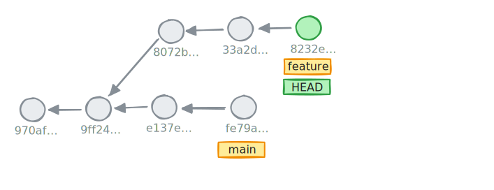
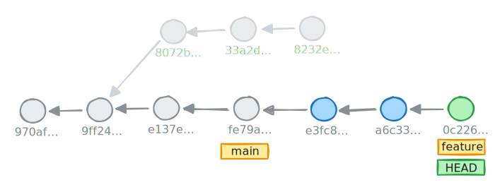

---
clicks: 7
---


<SlideCurrentNo absolute bottom-0 right-2/>
<Link to="merge-rebase" absolute top-3.4 font-bold right-15 color="#db4c37">Merge - Rebase</Link>

# Rebase - Step by Step
How it works under the hood

````md magic-move { at: 7 }
```bash
git rebase main
```
```bash {2}
git rebase main
git reset --hard 8232e
```
````

<div v-click="[1]" absolute>

`HEAD` moves in a _detached_ mode onto the new base pointed here by `main`
</div>
<div v-click="[2]" absolute>

git applies changes from `8072b` commit
</div>
<div v-click="[3]" absolute>

git applies changes from `33a2d` commit
</div>
<div v-click="[4]" absolute>

git applies changes from `8232e` commit
</div>
<div v-click="[5]" absolute>

git moves the `feature` reference from `8232e` to `0c226`
</div>
<div v-click="[6]" absolute>

- **We rewrite the `feature` branch history!**
- Commits are not modified, new ones are created
</div>

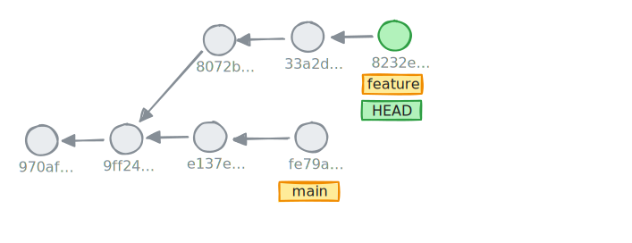
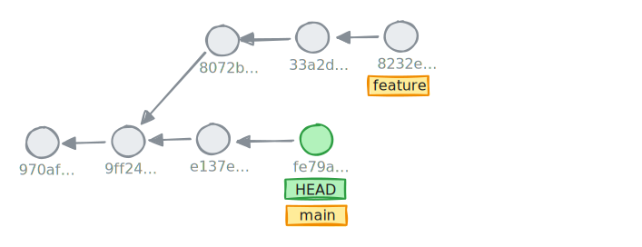
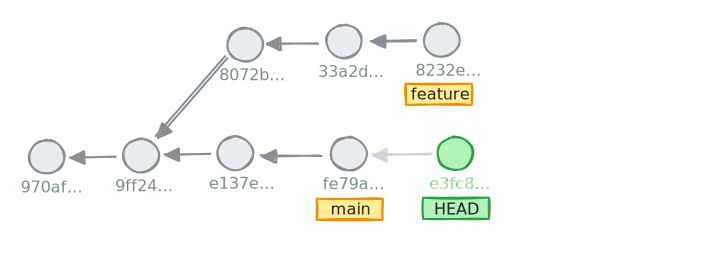
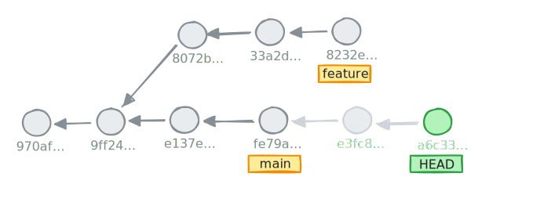
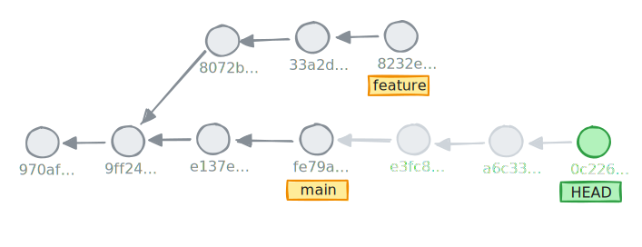
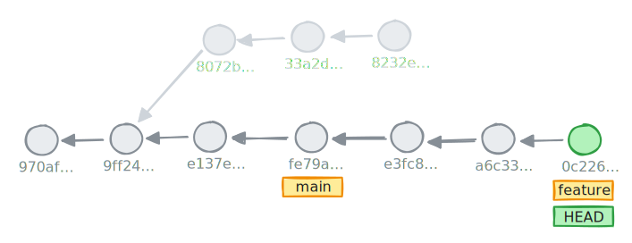
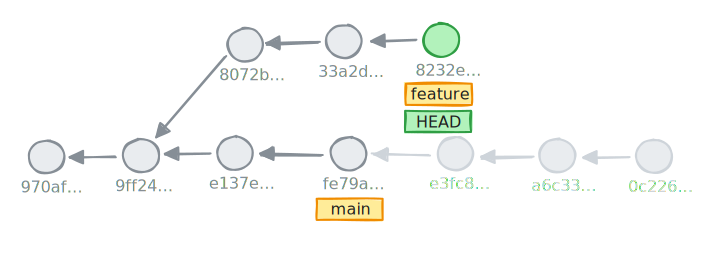

---
clicks: 9
---


<SlideCurrentNo absolute bottom-0 right-2/>
<Link to="merge-rebase" absolute top-3.4 font-bold right-15 color="#db4c37">Merge - Rebase</Link>

# Rebase - Conflict

<div absolute w-217 v-click="[0,3]" >

````md magic-move { at: 1 }
```bash{0|1}
git rebase main
```
```bash
git rebase main
CONFLICT (content): Merge conflict in README.md
error: could not apply 8072b... docs: add contributing section
hint: Resolve all conflicts manually, mark them as resolved with
hint: "git add/rm <conflicted_files>", then run "git rebase --continue".
hint: You can instead skip this commit: run "git rebase --skip".
hint: To abort and get back to the state before "git rebase", run "git rebase --abort".
hint: Disable this message with "git config set advice.mergeConflict false"
Could not apply 8072b... docs: add contributing section
```
````
</div>

<div scale-90 mt="-1" ml="-11" absolute w-217 v-click="[3,5]">

````md magic-move { at: 3 }
```bash{0|1}
git status
```
```bash
git status
interactive rebase in progress; onto fe79a
Last command done (1 command done):
  pick 8072b docs: add contributing section
2 commands remaining:
  pick 33a2d feat: add birthday to GET /user
  pick 8232e ci: stabilize flakky tests
You are currently rebasing branch 'feature' on 'fe79a'.
  (fix conflicts and then run "git rebase --continue")
  (use "git rebase --skip" to skip this patch)
  (use "git rebase --abort" to check out the original branch)

Unmerged paths:
  (use "git restore --staged <file>..." to unstage)
  (use "git add <file>..." to mark resolution)
        both modified:   README.md

no changes added to commit (use "git add" and/or "git commit -a")
```
````
</div>

<div absolute w-217 v-click=[5]>

```
nvim README.md
file content

< <<<<<< HEAD
Text being on the main branch in this case.
=======
Text being on the feature branch.
>>>>>>> 8072b (docs: add contributing section)
```
</div>

<div absolute w-217 v-click="[6,9]">

````md magic-move { at: 7 }
```bash
git add README.md
```
```bash {2}
git add README.md
git rebase --continue
```
```bash {2,3}
git add README.md
git rebase --continue
Successfully rebased and updated refs/heads/feature.
```
````
</div>
<div absolute w-217 v-click="[9]">

```bash
git rebase --abort # during a rebase
git reset --hard 8232e
```
</div>


---


<SlideCurrentNo absolute bottom-0 right-2/>
<Link to="merge-rebase" absolute top-3.4 font-bold right-15 color="#db4c37">Merge - Rebase</Link>

# When to use `merge` or `rebase`?
Ze question.

<v-clicks>

- <span v-mark.green.highlight="{at: 1, animate: false}">Rebase</span>
  - To update a branch in relation to another branch, being most of the time the original parent branch
  - **Before** integration towards another _long-lived_ branch
- <span v-mark.green.highlight="{at: 2, animate: false}">Merge</span>
  - To integrate a branch in another branch
  - `fast forward` -> **linear history**
  - `no fast forward` -> **semi-linear history**
</v-clicks>

---

<div border-7 border-blue absolute top-0 left-0 bottom-0 right-0 z="-1"/>

<SlideCurrentNo absolute bottom-0 right-2/>
<Link to="merge-rebase" absolute top-3.4 font-bold right-15 color="#db4c37">Merge - Rebase</Link>

# Hands-on - 15 minutes

```bash
git clone https://github.com/Tenshock/git-exercise.git tp-rebase-conflict
cd tp-rebase-conflict
[bash|zsh] init-2.sh
```

1. Merge `feature` branch into `main` branch. Which mode is used?
2. Cancel the merge
3. Rebase `feature` branch onto `main` branch
4. Merge `feature` branch into `main` branch. Which mode is used? Why?
5. Rebase `conflict` branch onto `main` branch. Accept both modifications
6. Rebase `conflict-heaven` branch onto `main` branch. Accept only modifications from `main` branch
7. Rebase `conflict-hell` branch onto `main` branch. Accept only modifications from `main` branch. Give up whenever you want
8. Can you explain what happened in the previous question?

---

<div border-7 border-green absolute top-0 left-0 bottom-0 right-0 z="-1"/>

<SlideCurrentNo absolute bottom-0 right-2/>
<Link to="merge-rebase" absolute top-3.4 font-bold right-15 color="#db4c37">Merge - Rebase</Link>

# Correction

1. Merge `feature` branch into `main` branch. Which mode is used?
```bash
git switch main
git merge feature # It's no fast-forward mode
```

2. Cancel the merge
```bash
git reset --hard HEAD^ # or @^ or HEAD~1, etc
```

3. Rebase `feature` branch onto `main` branch
```bash
git switch feature
git rebase main
```

4. Merge `feature` branch into `main` branch. Which mode is used? Why?
```bash
git switch main
git merge feature # It's fast forward mode
```

---

<div border-7 border-green absolute top-0 left-0 bottom-0 right-0 z="-1"/>

<SlideCurrentNo absolute bottom-0 right-2/>
<Link to="merge-rebase" absolute top-3.4 font-bold right-15 color="#db4c37">Merge - Rebase</Link>

# Correction

5. Rebase `conflict` branch onto `main` branch. Accept both modifications
```bash
git switch conflict
git rebase main
vim README.md
git add README.md
git rebase --continue
```

6. Rebase `conflict-heaven` branch onto `main` branch. Accept only modifications from `main` branch
```bash
git switch conflict-heaven
git rebase main
vim README.md
git add README.md
git rebase --continue
```

---

<div border-7 border-green absolute top-0 left-0 bottom-0 right-0 z="-1"/>

<SlideCurrentNo absolute bottom-0 right-2/>
<Link to="merge-rebase" absolute top-3.4 font-bold right-15 color="#db4c37">Merge - Rebase</Link>

# Correction

7. Rebase `conflict-hell` branch onto `main` branch. Accept only modifications from `main` branch. Give up whenever you want
```bash
git switch conflict-hell
git rebase main
# Repeat
vim README.md
git add README.md
git rebase --continue
# When you're fed up
git rebase --abort
```

8. Can you explain what happened in the previous question?
```
Modifications from rebase-hell are always in the same section, the conflicting section with main.
```

