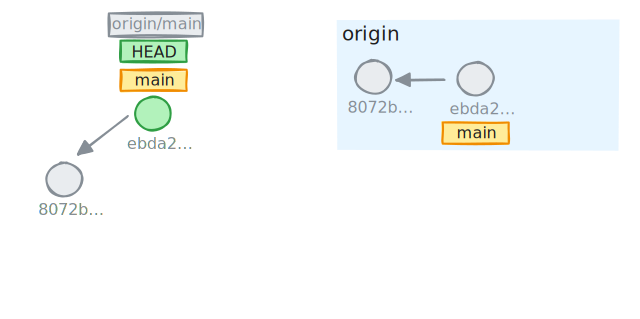

<SlideCurrentNo absolute bottom-0 right-2/>
<Link to="remotes" absolute top-3.4 font-bold right-15 color="#db4c37">Remotes</Link>

# Summary

1. <Link to="introduction">Introduction</Link>
2. <Link to="installation-and-configuration">Installation and configuration</Link>
3. <Link to="fundamental-principles">Fundamental principles</Link>
4. <Link to="commits-and-history">Commits and history</Link>
5. <Link to="references">References</Link>
6. <Link to="merge-rebase">Merge - Rebase</Link>
7. <Link to="remotes">Other commands and tools</Link>
8. <Link to="my-history-is-beautiful">My History is Beautiful</Link>
9. <span v-mark.box.green="{ at: 1, animate: false }">**Remotes**</span>
10. <Link to="workflows">Workflows</Link>

---


<SlideCurrentNo absolute bottom-0 right-2/>
<Link to="remotes" absolute top-3.4 font-bold right-15 color="#db4c37">Remotes</Link>

# Clone
To get a repository from another location

- Clones completely the repository: objects, tags and branches
- Configures a remote named `origin` by default
- The remote repository may be exposed via **ssh**, **https**, file (locally)

 <div v-click mt-5>

```bash
# Creates a repository
git clone <repository_url> [<directory_name>]

# Limit the clone depth to 50 last commits
git clone <repositoy_url> --depth 50
```
</div>

---


<SlideCurrentNo absolute bottom-0 right-2/>
<Link to="remotes" absolute top-3.4 font-bold right-15 color="#db4c37">Remotes</Link>

# Bare Repository

- A bare repository is a repository without `working tree` nor `index`
- Is it mainly used by repositories that act as central repositories
- the repository directory contains files that are usually contained in the `./.git` folder

<div v-click mt-5>

```bash
# To create a bare repository
git init --bare

# Clone a repository as bare
git clone --bare <repository_url>
```
</div>

---


<SlideCurrentNo absolute bottom-0 right-2/>
<Link to="remotes" absolute top-3.4 font-bold right-15 color="#db4c37">Remotes</Link>

# Remote branch

- Created by a `clone` or a `fetch`
- Local copy of the corresponding branch counterpart in the remote repository
- A work is never done directly on a remote branch but on a local copy of it

<div v-click mt-5>

```bash
# List remote branches only
git branch --remotes # or git branch -r

# List local and remote branches
git branch --all # or git branch -a
```
</div>

---
clicks: 6
---


<SlideCurrentNo absolute bottom-0 right-2/>
<Link to="remotes" absolute top-3.4 font-bold right-15 color="#db4c37">Remotes</Link>

# Fetch
Get updates from a remote

- Updates the remote reference (by default, only creations are retrieved)
- Get commits reachable by remote references
- Do not touch local references


<div v-click="1">

````md magic-move { at: 2 }
```bash {0|1}
git fetch
```
```bash {1|2}
git fetch
git fetch --prune
```
```bash {2|3}
git fetch
git fetch --prune
git fetch --prune-tags
```
````


</div>

---
clicks: 7
---


<SlideCurrentNo absolute bottom-0 right-2/>
<Link to="remotes" absolute top-3.4 font-bold right-15 color="#db4c37">Remotes</Link>

# Pull
Only a fetch with a merge OR rebase

`git pull` updates a local branch compared to its remote counterpart.

- Always performs a `git fetch` before
- 2 modes:
    - `git pull` in merge flavor (default)
    - `git pull` in rebase flavor

<div v-click="1">

````md magic-move
```bash {0|0|1|1}
git pull
```
```bash {0|1|1}
git pull --rebase
```
```bash
git config [--local | --global] pull.rebase true
```
````


</div>

---
clicks: 9
---


<SlideCurrentNo absolute bottom-0 right-2/>
<Link to="remotes" absolute top-3.4 font-bold right-15 color="#db4c37">Remotes</Link>

# Push
To upload changes to remotes repository

- By default, publish all commits from local branch to its remote counterpart
- Only a fast-forward merge is authorised, the push aborts if it is not the case

<div v-click="1">

````md magic-move { at: 2 }
```bash
git push [remote] [local_ref:remote_ref]
```
```bash
git push origin main:main
To github.com:torvalds/linux.git
 ! [rejected]        main -> main (non-fast-forward)
error: failed to push some refs to 'github.com:torvalds/linux.git'
hint: Updates were rejected because the tip of your current branch is behind
hint: its remote counterpart. If you want to integrate the remote changes,
hint: use 'git pull' before pushing again.
hint: See the 'Note about fast-forwards' in 'git push --help' for details.
```
```bash {2|2}
git push origin main:main
git pull --rebase
```
```bash {3|3}
git push origin main:main
git pull --rebase
git push origin main:main
```
```bash {0|1}
git push origin main:main --force
```
````

<div v-click="9">

- Push even if there is diverging history
- local branch **overrides** the remote branch
- `--force-with-lease`: allows only if the local remote ref is equal to the remote ref
</div>



</div>


---
clicks: 7
---


<SlideCurrentNo absolute bottom-0 right-2/>
<Link to="remotes" absolute top-3.4 font-bold right-15 color="#db4c37">Remotes</Link>

# Push - Set Upstream
Sync a local branch with a remote one

The fact to sync a local branch with a remote one is called to **track the remote branch**.  
We do that by defining the remote branch to track as the **upstream** branch.


<div v-click="1">

````md magic-move { at: 2 }
```bash {0|1}
git push
```
```bash
git push
fatal: The current branch test has no upstream branch.
To push the current branch and set the remote as upstream, use

    git push --set-upstream origin test

To have this happen automatically for branches without a tracking
upstream, see 'push.autoSetupRemote' in 'git help config'.
```
```bash {2|2}
git push
git push --set-upstream origin test
```
```bash {3}
git push
git push --set-upstream origin test
git commit -m 'a new commit' --allow-empty
```
```bash {4}
git push
git push --set-upstream origin test
git commit -m 'a new commit' --allow-empty
git push
```
````


</div>

---
clicks: 5
---


<SlideCurrentNo absolute bottom-0 right-2/>
<Link to="remotes" absolute top-3.4 font-bold right-15 color="#db4c37">Remotes</Link>

# Push - Track
Get a remote branch and track it

````md magic-move
```bash {0}
git switch test
```
```bash
git switch test
fatal: invalid reference: test
```
```bash {0|3}
git switch test
fatal: invalid reference: test
git fetch
```
```bash {4}
git switch test
fatal: invalid reference: test
git fetch
git switch test
```
```bash {4-6}
git switch test
fatal: invalid reference: test
git fetch
git switch test
# or
git switch --create test --track origin/test
```
````


---
clicks: 2
---


<SlideCurrentNo absolute bottom-0 right-2/>
<Link to="remotes" absolute top-3.4 font-bold right-15 color="#db4c37">Remotes</Link>

# Push - Delete
Delete a remote reference

````md magic-move
```bash {0|1}
git push origin --delete test
```
```bash
git push origin --delete test
# OR
git push origin :test
```
````


---
clicks: 2
---


<SlideCurrentNo absolute bottom-0 right-2/>
<Link to="remotes" absolute top-3.4 font-bold right-15 color="#db4c37">Remotes</Link>

# Push - Tags
Push tags, quite explicit

````md magic-move
```bash {0|1}
git push origin latest
```
```bash
git push origin latest
git push --tags
```
````


---

<div border-7 border-blue absolute top-0 left-0 bottom-0 right-0 z="-1"/>

<SlideCurrentNo absolute bottom-0 right-2/>
<Link to="remotes" absolute top-3.4 font-bold right-15 color="#db4c37">Remotes</Link>

# Hands-on - 15 minutes

1. Create a new git project
2. Add a `README.md` file and commit it
3. On your favorite hosting platform (Github, Gitlab, Azure), create a new blank project
4. Associate your local git project to the newly created project on your hosting platform
5. Publish your default branch to the configured remote
6. List local and remote branches
7. Create a new tag `0.0.1` and publish it to the remote
8. Create a new branch `backup` in your current `HEAD`, publish it
9. Oops, delete it remotely, we didn't want it
10. Also delete the tag everywhere
11. list all branches

---

<div border-7 border-green absolute top-0 left-0 bottom-0 right-0 z="-1"/>

<SlideCurrentNo absolute bottom-0 right-2/>
<Link to="remotes" absolute top-3.4 font-bold right-15 color="#db4c37">Remotes</Link>

# Correction

1. Create a new git project
```bash
git init my-project
cd my-project
```

2. Add a `README.md` file and commit it
```bash
echo '# My Project!' > README.md
git add README.md
git commit -m 'docs: add README'
```

3. On your favorite hosting platform (Github, Gitlab, Azure), create a new blank project
```bash
I let you read the hosting platform manual (:
```

4. Associate your local git project to the newly created project on your hosting platform
```bash
git remote add <hosting_platfom_project_url>
```

5. Publish your default branch to the configured remote
```bash
git push --set-upstream origin main
```

---

<div border-7 border-green absolute top-0 left-0 bottom-0 right-0 z="-1"/>

<SlideCurrentNo absolute bottom-0 right-2/>
<Link to="remotes" absolute top-3.4 font-bold right-15 color="#db4c37">Remotes</Link>

6. List local and remote branches
```bash
git branch -a
```

7. Create a new tag `0.0.1` and publish it to the remote
```bash
git tag 0.0.1
git push 0.0.1
```

8. Create a new branch `backup` in your current `HEAD`, publish it
```bash
git branch backup
git push origin backup:backup
```

9. Oops, delete it remotely, we didn't want it
```bash
git push origin :backup
```

10. Also delete the tag everywhere
```bash
git tag -d 0.0.1
git push origin :0.0.1
```

11. list all branches
```bash
git branch -a
```

---
clicks: 2
---


<SlideCurrentNo absolute bottom-0 right-2/>
<Link to="remotes" absolute top-3.4 font-bold right-15 color="#db4c37">Remotes</Link>

# Collaborative Projects
Another way to work together


